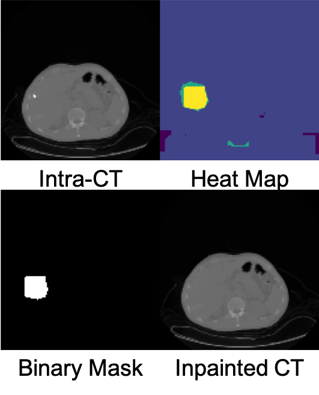

# Grad-CAM based Inpainting 

## About

## Requirements

1. Download and install Anaconda,
2. Start Anaconda Navigator,
3. Create TensorFlow environment (Tab "Environments"),
4. Select TensorFlow environment and install: keras, tensorflow, matplotlib, nomkl and pillow,
5. Install Jupyter Notebook (Tab "Home").

## Run
1. Activate TF environment (tab "Environments"),
2. Launch Jupyter Notebook (tab "Home"),
3. Open "CNN.ipynb"-file inside the Jupyter Notebook and run all cells starting at the top.
